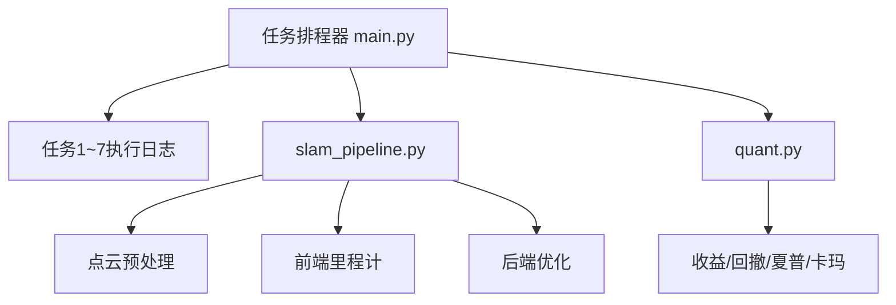

# 核心架构设计与创新说明

## 1. 系统总览
本仓库实现“任务编排 + 户外SLAM骨架 + 量化研究骨架 + 文档化流程”。

## 2. SLAM逻辑功能
- 预处理：点云高度裁剪，降低噪声。
- 前端：利用IMU增量估计短时位姿。
- 后端：轨迹平滑，形成可用于控制的稳定轨迹。

## 3. 量化逻辑功能
- 指标：年化收益、最大回撤、夏普比率、卡玛比率。
- 风控：通过回撤刻画策略承压能力，配合阈值做策略下线。

## 4. 算法推理（简述）
1) 位姿增量估计：
- 用加速度近似位移增量（demo骨架），用于前端里程计快速更新。
2) 回撤计算：
- 动态峰值与当前净值之差占比，即最大回撤。

## 5. 创新点
- 将“战略任务管理”与“工程实现骨架”统一到同一仓库，可直接执行+复盘。
- 代码与文档强绑定：每个核心模块均有对应说明，便于二次扩展。
- 先给可运行最小闭环，再按模块替换为生产级组件（LiDAR前端、因子引擎、实盘网关）。
