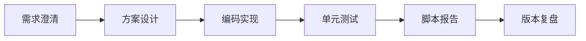

# 持续优化策略（到明天前 5 次版本）

## 目标
- 在当前可运行骨架上完成 5 次迭代，确保每次都有“变更点 + 验收测试 + 输出文档”。

## 版本节奏
1. v1.1 稳定性：修边界、补测试、提升可读性。
2. v1.2 性能：回测/回放性能剖析，记录指标。
3. v1.3 功能：扩策略插件与批量处理。
4. v1.4 工程化：报告与质量门禁。
5. v1.5 运营化：形成计划、报告、审计闭环。

## 每次迭代固定流程

## 验收规则
- 必须可执行（CLI/脚本可跑通）
- 必须可测试（pytest通过）
- 必须可追溯（文档有版本记录）
