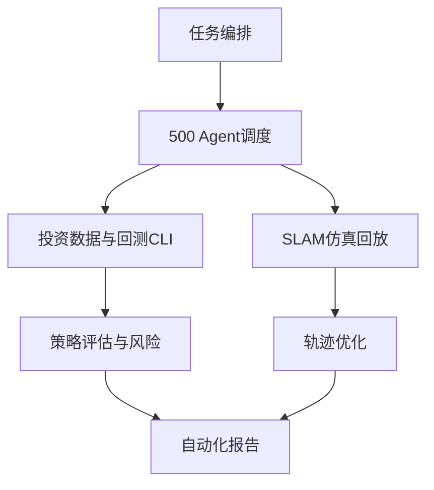

# 全量系统架构论证（500 Agents + Skills + 算法模块）

## 背景研究与功能拆解
- 目标分层：战略层（7任务）→执行层（日程编排）→算法层（SLAM/量化）→运营层（报告/复盘）。
- 能力分层：数据、模型、执行、风控、审计、知识库。

## 500 Agent 调度架构
- `orchestration.generate_agent_plan()` 生成 500 agent 的任务分配清单。
- 每个 agent 绑定 skill 与 workstream，实现全覆盖调度。

## 核心流程图

## 回测CLI
- 输入：真实行情CSV（Date,Close）。
- 插件：`strategy.py` 中策略工厂可插拔扩展。
- 输出：年化收益/回撤/夏普/卡玛。

## SLAM回放器
- 输入：仿真传感器CSV。
- 执行：预处理→前端里程计→后端优化。
- 输出：回放帧数和优化轨迹数。

## 测试与自动化
- 单元测试：quant、backtest-cli、slam-replay。
- 建议接入CI：pytest + coverage + artifact报告。
