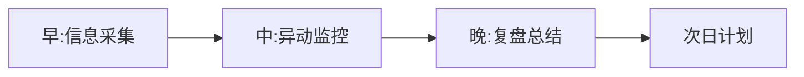

# 每日流程图与执行SOP

```mermaid
flowchart LR
    P1[早:信息采集] --> P2[中:异动监控]
    P2 --> P3[晚:复盘总结]
    P3 --> P4[次日计划]
```

## SOP
1. 早：抓取宏观/行业/公司事件，输出观察池。
2. 中：监控波动与情绪分数，触发预警。
3. 晚：更新策略绩效，输出仓位建议。
4. 周：汇总KPI与收入漏斗，决定下周研发优先级。
